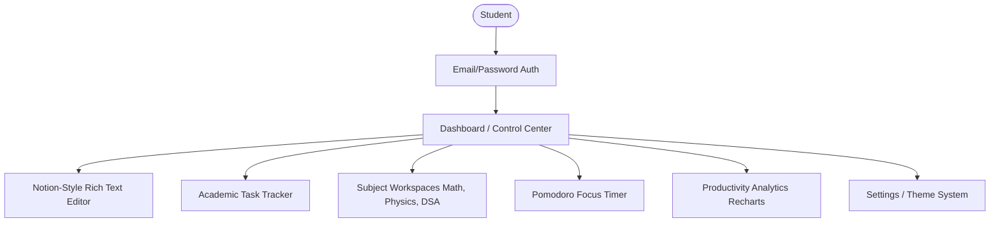

# Notela Project Analysis & Logo Design

This document provides a comprehensive analysis of **Notela**, explores its visual identity and color combinations, and presents the newly generated high-definition logo.

---

## 🚀 1. Project Analysis & Understanding

**Notela** is designed as a premium, single-user **Student Productivity SaaS Web Application**. Rather than building another complex team collaboration tool, Notela focuses on resolving student cognitive overload by functioning as a personal academic operating system.

### Core Architecture & Flow

### Core Features & UX Goals
1. **Calm Cockpit Dashboard**: Serves as the nervous system of the app. It tracks streaks, focus time, tasks, and recent notes without clutter.
2. **Autosaving Notes System**: A lightweight editor with inline markdown formatting, checklists, quotes, and code blocks.
3. **Subject Workspaces**: Segregates notes, tasks, and assignments by subject (e.g., DSA, Math) using a guided step-by-step creation wizard (using the `Stepper` component).
4. **Pomodoro Focus Timer**: Integrates study-break cycles directly with history and analytics.
5. **Productivity Analytics**: Clean, minimal charts showing streaks and weekly trends using Recharts.

---

## 🎨 2. Design System & Color Palette Analysis (Webpage Audit)

From the screenshots of the Notela landing page and dashboard, the interface uses a highly curated, modular color-coded scheme to separate tools while maintaining a cohesive visual flow.

### Color-Coding Matrix
Notela assigns specific, low-opacity pastel background colors paired with vibrant, high-contrast text colors for each functional area. This creates instant visual mapping for the student:

| Module / Tool | Text/Icon Hex | Pale Background | Visual Identity |
| :--- | :--- | :--- | :--- |
| **Subject Workspaces** | `#4F46E5` (Indigo) | `#F5F6FF` (Light Lavender) | Calm, structured organizing space |
| **Lightweight Tasks** | `#10B981` (Emerald) | `#F0FDF4` (Light Mint) | Clean, successful completion vibe |
| **Focus Pomodoro** | `#D97706` (Amber/Orange) | `#FFFBEB` (Light Peach) | Energetic, time-sensitive alert state |
| **Productivity Insights** | `#8B5CF6` (Purple) | `#FAF5FF` (Light Violet) | Analytical, insightful, futuristic |
| **Brand Identity** | `#8B5CF6` (Purple) | *N/A (Header)* | Matches the logo's purple stroke |

### UI Design Principles observed on Webpage:
* **Background Grid**: The landing page uses a very soft off-white (`#FCFCFD`) Canvas layered with a subtle light-grey geometric grid pattern, which matches the modern SaaS branding aesthetic.
* **Typography Hierarchy**: Headers use deep dark charcoal/black (`#000000`) for the hook words, and medium grey (`#6B7280`) for supporting body descriptions. Some headers feature a soft grey-to-black gradient fade-out to guide the eye.
* **Interactive Accents**:
  - The primary Call-to-Action button ("Get Started for Free") uses a solid blue-indigo gradient (`#4F46E5` / `#3B82F6`) to draw maximum attention.
  - Active navigation pills in the Sidebar use a soft purple background tint with a blue indicator line.
  - Gamified metrics (like Study Streak badges) feature a warm orange gradient to feel rewarding.

---

## 🖼️ 3. Refined High-Definition Logo (Reference-Based Edition)

Based on the original logo found in your landing page header, we have regenerated a high-definition, perfectly polished version that preserves the core shape while refining the lines, lighting, and rendering quality.

### Design Elements Retained & Enhanced:
- **Origami / Folded Ribbon Concept**: Preserved the original stylized letter **"N"** ribbon folds.
- **Precision Gradient Mapping**:
  - **Left Pillar**: Features a vibrant cyan-to-royal-blue gradient.
  - **Diagonal Joint**: Features a deep indigo-navy fold with soft shadow boundaries that give it a clean 3D physical layout.
  - **Right Pillar**: Features a warm violet-to-magenta gradient.
- **SaaS Styling**: Presented on a soft white rounded card with a premium outer drop shadow (for light interfaces) or directly transparent (for dark/glassmorphic navbars), matching the original startup look.

---

## 🛠️ 4. Next Steps
To use this logo in the codebase:
1. The new image has already been copied to your project at `public/Logo_new.png`.
2. To use it as the main logo, you can rename it to `public/Logo.png` to overwrite the original.
